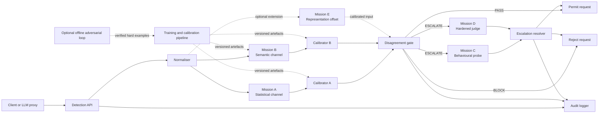
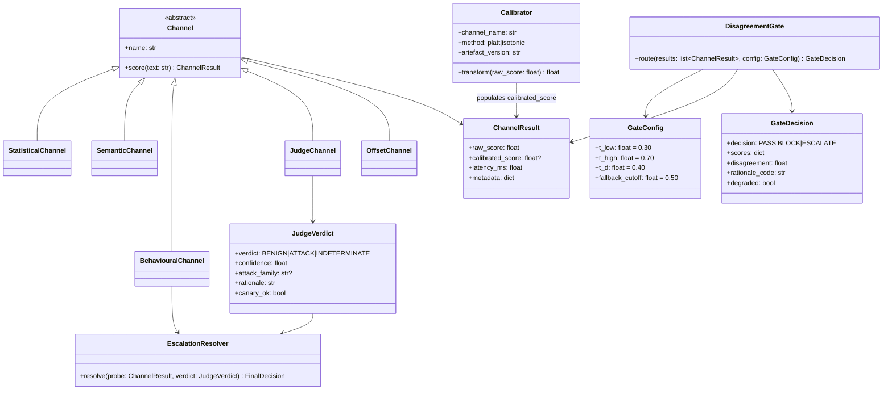
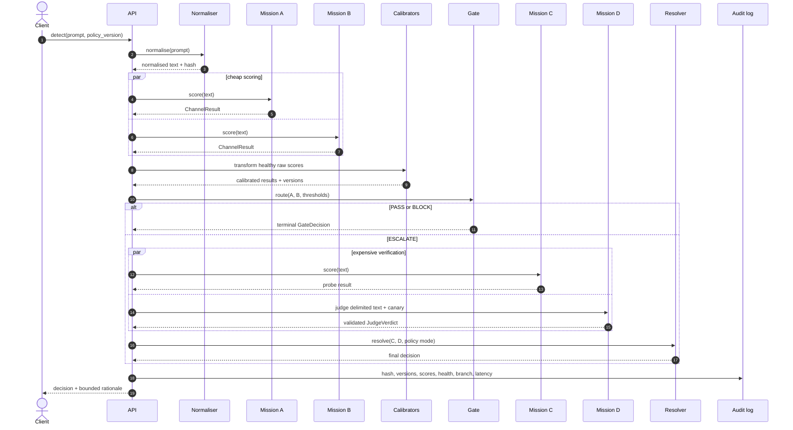
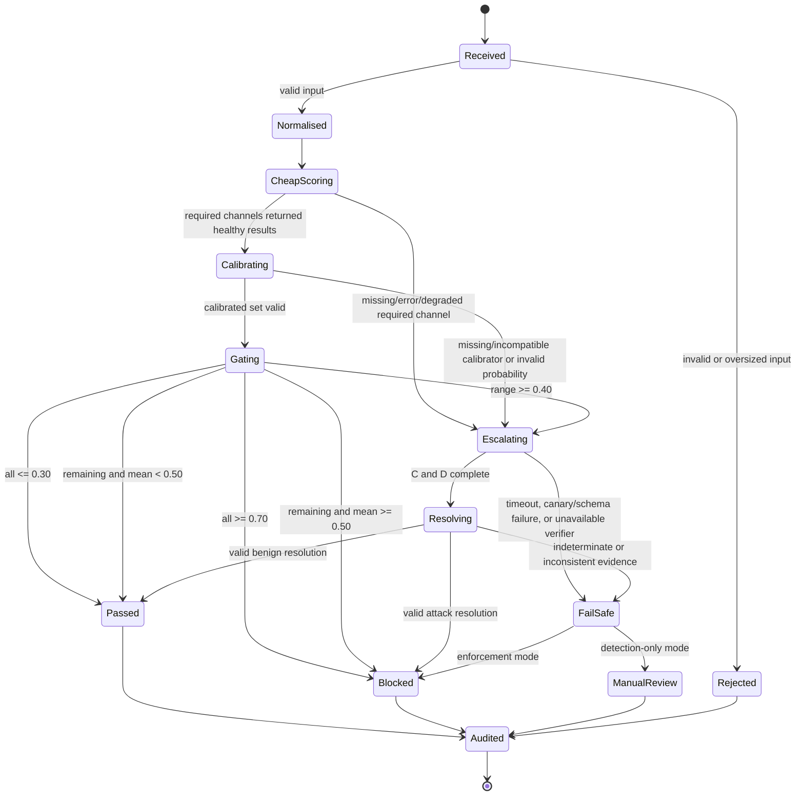

# DGAD Design Checkpoint

**Status:** proposed architecture for review; not an implementation report  
**Evidence basis:** `AGENTS.md`, `final_plan.md`, and `DGAD_Complete_Project_Guide.md` from the supplied context package  
**Checkpoint scope:** core single-prompt detection path, interfaces, decision policy, calibration, failure behaviour, and evidence required before any implementation claim

## 1. Evidence boundary and source reconciliation

The supplied package contains planning documents, a presentation, figures, and a presentation generator. It does **not** contain the `main/` directory or the `src/dgad/`, tests, dashboard, evaluation outputs, model artefacts, CI records, or deployment artefacts described by the documents. Therefore this checkpoint can verify the design only. It cannot verify executable behaviour, test counts, benchmark results, latency, cost, accuracy, calibration quality, deployment readiness, or the statements that the project is “94% implemented” and that 94 tests pass.

There is a direct source inconsistency. `AGENTS.md` and `DGAD_Complete_Project_Guide.md` describe a completed implementation under `main/`, while `final_plan.md` explicitly presents specifications rather than finished code. Because `main/` is absent from the supplied context package, this document uses `final_plan.md` as the architectural proposal and labels the package's implementation claims as **unverified**. A separately cloned repository may be used to audit implementation, but it is separate evidence and does not retroactively make the supplied package complete. No benchmark value below should be read as an observed result unless it is traced to reproducible raw output.

### 1.1 Reference implementation delta observed in the separate clone

A targeted read of `main/src/dgad/gate.py`, `pipeline.py`, `config.py`, `schemas.py`, and `main/results/train_meta.json` in the separate repository clone establishes limited source facts, not full-system verification:

| Area | Observed source behaviour | Checkpoint target / gap |
|---|---|---|
| Entry point | `DetectionPipeline.detect(prompt)` | Diagrams and contracts use `detect`, not `predict`. |
| Cheap execution | A, B, and E are scored in a serial `for` loop | The sequence diagram's parallel block is desired architecture; latency claims require either implementation change or a serial-path measurement. |
| Calibration | If a calibrator is absent, the raw score is passed to the gate | Target requires calibrated scores; raw fallback violates comparability and should escalate. |
| Partial failure | Degraded channels are removed; any remaining healthy channel may auto-PASS/BLOCK | Target requires all configured cheap channels healthy; a missing required channel escalates. |
| Zero healthy | Forced to `ESCALATE` | Aligned with the fail-safe target. |
| Middle equality | Fused cutoff is `(t_low + t_high)/2`; equality blocks | With defaults this is `0.50`, aligned with the explicit same-middle policy below. |
| Escalation fusion | Judge score, or `0.7 * judge + 0.3 * probe` when probe is healthy; threshold `0.5` | Weights are hard-coded outside configuration; a degraded judge becomes neutral `0.5` and can block without an explicit compromised-verdict branch. Resolver policy needs an ADR and failure tests. |
| Channel result schema | Four planned fields exist | Bounds, finite-value validation, health/error/version fields are not enforced by the schema. |
| Judge schema | Verdict permits only `attack` or `benign` | No `INDETERMINATE` state or canary field in the read schema. |
| Threshold defaults | Config contains `.30`, `.70`, `.40` and a separate escalation-rate target `.15` | `train_meta.json` records `gate_agreement_threshold=.3` and `gate_disagreement_threshold=.15`; names do not map directly to the runtime config. This artefact must not be treated as proof that runtime `t_d=.40` was tuned or that `.15` is a tuned `t_d`. |

This comparison is intentionally bounded. It does not verify tests, runtime dependencies, models, service fallbacks, API behaviour, or benchmark claims.

The bounded checkpoint is:

- **Mission A:** statistical surface-form detection (Channel A).
- **Mission B:** semantic intent detection (Channel B).
- **Routing:** calibrated A/B scores enter the disagreement gate.
- **Mission C:** behavioural perturbation probe, invoked only after escalation.
- **Mission D:** hardened LLM judge, invoked only after escalation.
- **Mission E:** black-box representation-offset detector. It is documented in the broader plan as a third cheap channel, but it is outside the minimum A/B-to-C/D checkpoint and remains an optional extension until its latency, calibration, and incremental value are evidenced.
- **Self-adversarial calibration loop:** optional future research scope. It searches for false agreement, retrains Channel B, refits calibrators, and retunes the gate. It must not be represented as an online production feedback loop without data governance, holdout isolation, and regression evidence.

## 2. Proposed component architecture

The deployment unit is proposed as one Python package and one FastAPI backend. The synopsis/plan disagreement about Node/Express remains a mentor decision; this checkpoint assumes the plan's FastAPI-only proposal.

## 3. Proposed class model

## 4. Interface contracts

### 4.1 Channel contract

Every channel proposes the same replaceable contract:

`score(text: str) -> ChannelResult`

`ChannelResult` must contain:

| Field | Contract |
|---|---|
| `raw_score` | Finite detector-native score. Its scale must be documented per channel. |
| `calibrated_score` | `null` before calibration; otherwise a finite probability in `[0,1]`, where larger means more likely attack. |
| `latency_ms` | Non-negative elapsed time measured consistently. |
| `metadata` | Structured, serialisable metadata including `channel`, `model_version`, `degraded`, `error_code`, and `calibrator_version` where applicable. Raw prompt content must not be required. |

Exceptions must be caught at the channel boundary and represented as a degraded result. The neutral `0.5` value described in the guide is a diagnostic placeholder and must never count as healthy evidence for automatic PASS or BLOCK.

### 4.2 Gate contract

The gate accepts only normalised, calibrated results with an explicit health flag. It returns `GateDecision(decision, scores, disagreement, rationale_code, degraded)`. It must not silently compare Channel A perplexity with Channel B probability. `rationale_code` must identify the exact branch taken.

For the minimum checkpoint, the healthy routing set is `{A, B}`. If Mission E is enabled later, the configured required set becomes `{A, B, E}` and all acceptance tests must be rerun; E must not appear or disappear per request without the policy version changing.

### 4.3 Escalation contract

Mission C returns an attack probability plus probe trace metadata. Mission D returns a schema-validated `JudgeVerdict`. The proposed resolver gives the judge primary semantic authority and uses C as corroborating evidence:

1. Valid judge `ATTACK` -> `BLOCK`.
2. Valid judge `BENIGN` -> `PASS`, unless the canary fails or C is degraded/invalid, in which case fail safe.
3. Judge `INDETERMINATE`, schema failure, timeout, canary failure, or both expensive channels unavailable -> `BLOCK` in enforcement mode and `ESCALATE`/manual review in detection-only mode.

This resolver is a proposal requiring mentor sign-off and tests; the sources describe C/D escalation but do not fully specify their fusion rule.

## 5. Exact routing policy

Default proposed configuration:

- `t_low = 0.30`
- `t_high = 0.70`
- `t_d = 0.40`
- `fallback_cutoff = 0.50`
- disagreement `d = max(score) - min(score)` over the configured healthy cheap-channel set
- all comparisons are inclusive as shown below

The following ordered predicates are mutually exclusive. Let `S` be the configured calibrated cheap scores.

| Priority | Predicate | Decision | Rationale code |
|---:|---|---|---|
| 0 | Any required score missing, non-finite, outside `[0,1]`, uncalibrated, stale/incompatible, or marked degraded; or fewer than all configured required channels are healthy | `ESCALATE` | `CHEAP_CHANNEL_INVALID` |
| 1 | `max(S) <= 0.30` | `PASS` | `LOW_AGREEMENT` |
| 2 | `min(S) >= 0.70` | `BLOCK` | `HIGH_AGREEMENT` |
| 3 | `d >= 0.40` | `ESCALATE` | `SCORE_DISAGREEMENT` |
| 4 | Remaining cases and `mean(S) < 0.50` | `PASS` | `MIDDLE_FUSION_LOW` |
| 5 | Remaining cases and `mean(S) >= 0.50` | `BLOCK` | `MIDDLE_FUSION_HIGH` |

This preserves the guide's documented “otherwise fused mean decides” branch while removing its unspecified cutoff and equality behaviour. Examples:

| A | B | Result | Reason |
|---:|---:|---|---|
| 0.30 | 0.30 | PASS | Inclusive low agreement. |
| 0.70 | 0.70 | BLOCK | Inclusive high agreement. |
| 0.20 | 0.60 | ESCALATE | Difference equals `0.40`; escalation is inclusive. |
| 0.31 | 0.31 | PASS | Same middle scores; no disagreement, mean below `0.50`. |
| 0.50 | 0.50 | BLOCK | Exact ambiguous same-middle case is resolved conservatively by `mean >= 0.50`. |
| 0.69 | 0.69 | BLOCK | Same middle scores, mean above cutoff. |
| 0.35 | 0.65 | BLOCK | Difference below `0.40`; mean equals cutoff. |
| missing | 0.10 | ESCALATE | Missing required evidence cannot auto-pass. |

The fallback mean is a documented baseline-like tie rule, not the novelty claim. Evaluation must report how many requests reach it. If the team instead wants all middle-band agreement to escalate, that is a policy change and requires a separate version and trade-off evaluation.

## 6. Request sequence

## 7. State machine

## 8. Calibration and threshold governance

Calibration is mandatory before gating because the raw channels have different score scales. A and B receive separate calibrators; Mission E, if enabled, receives its own. Platt scaling is the proposed default, with isotonic regression evaluated when validation data is sufficient. Calibrators are fitted only on the validation/calibration partition, never on train, test, or locked holdout data.

Each persisted calibrator must record channel/model version, feature/preprocessing version, training-data fingerprint, split identifier, method, fitting timestamp, seed, and calibration metrics. A model/calibrator mismatch is an invalid channel result and triggers escalation. Reliability diagrams and ECE must be reported before and after calibration, alongside Brier score or log loss. Thresholds must be selected on validation data under mentor-approved constraints, stored as a versioned policy, and frozen before final holdout evaluation. The `.30/.70/.40` values are design defaults from the guide, not empirically validated operating points.

Calibration acceptance requires adequate coverage by attack family and benign hard cases, no group leakage, deterministic rebuild from a fixed seed, and an explicit rollback path to the previous model/calibrator/policy bundle. Post-deployment drift monitoring may trigger recalibration review but must not silently fit on production labels.

## 9. Error, missing-channel, and security fail-safe behaviour

- Input validation failure: reject the request and log only safe metadata.
- Normalisation failure: do not send unnormalised hostile text to downstream channels; use fail-safe handling.
- Required cheap-channel error, timeout, missing model, absent calibrator, NaN/Infinity, invalid range, or version mismatch: mark degraded and escalate. A placeholder `0.5` is logged but excluded from gate arithmetic.
- All cheap channels unavailable: escalate; never PASS.
- Judge output parse/schema failure: retry at most once as proposed by the guide, then fail safe.
- Judge canary missing or altered: treat the verdict as compromised and fail safe.
- Mission C unavailable while D is valid: allow D to resolve only if the approved policy explicitly permits judge-only escalation; otherwise fail safe.
- Mission D unavailable: C alone must not auto-pass because the plan recognises C as weak alone; enforcement mode blocks and detection-only mode marks manual review.
- Audit-storage failure: detection may return its security decision, but must raise an operational alert and expose `audit_persisted=false`; the production policy must decide whether regulated deployments fail closed.
- Timeouts and circuit breakers must be bounded and observable. The documented “three failures/60 seconds” is a proposal until implemented and tested.

## 10. Mission E and optional adversarial loop

Mission E estimates the gap between surface wording and extracted intent using a paraphrase/intent extraction step and embedding distance. It is inspired by white-box representation-offset work but is only a black-box approximation. Its extraction call can make it slower and less reliable than A/B, and the sources inconsistently call it “cheap” while describing low-to-medium cost. Before adding E to the production gate, the team must show calibrated output, stable availability, incremental value in the A/B/E ablation, and an acceptable latency/escalation effect.

The self-adversarial loop is valuable future research for the false-agreement failure mode: attacks that drive all cheap scores below `t_low`. It must run offline, verify preserved attack intent, keep generated examples out of test/holdout sets, retain provenance, compare untouched attack families, and require human-reviewed promotion of a new model/calibrator/policy bundle. The guide calls verified attack examples “hard negatives”; under the stated label convention (`1 = attack`) they are more precisely **hard positive attack examples for detection**, even though they are negative examples of system safety. This terminology should be corrected before implementation.

## 11. Acceptance checklist and required evidence

An item is accepted only when the corresponding artefact is supplied and independently reproducible.

- [ ] **Architecture:** reviewed component, class, sequence, and state diagrams match the implemented call graph. Evidence: source links/commit and ADRs.
- [ ] **Contracts:** every enabled channel conforms to `ChannelResult`; malformed and degraded results are tested. Evidence: schema definitions and contract tests.
- [ ] **Routing completeness:** exhaustive boundary tests cover `0.30`, `0.70`, `0.40`, `0.50`, same-middle cases, NaN/Infinity, missing and degraded channels, and all policy branches. Evidence: test output and branch/condition coverage.
- [ ] **Mutual exclusivity:** property-based tests prove exactly one gate outcome for every valid score tuple and configuration. Evidence: test source, seed, and run log.
- [ ] **Calibration:** per-channel calibrators are fit without leakage and produce versioned reliability diagrams plus ECE and proper scoring metrics before/after. Evidence: split manifest, artefact metadata, generated figures, and evaluation log.
- [ ] **Threshold selection:** mentor-approved objectives/constraints are recorded before holdout evaluation. Evidence: signed decision/ADR and validation-only optimisation output.
- [ ] **Escalation resolver:** C/D fusion and every failure combination have approved policy and tests. Evidence: ADR, truth table, schema/canary/timeout tests.
- [ ] **Fail-safe:** zero healthy channels, judge outage, probe outage, corrupted output, and audit failure behave as documented. Evidence: fault-injection/integration test logs.
- [ ] **Mission A/B:** model cards, feature definitions, training provenance, per-family metrics, and benign over-defence evaluation exist. Evidence: reproducible evaluation artefacts; no hand-entered results.
- [ ] **Mission C/D:** probe configuration, judge prompt hardening, canary behaviour, cost accounting, and latency distributions are measured. Evidence: versioned configs and evaluation outputs.
- [ ] **Mission E decision:** include only after A/B versus A/B/E ablation shows its incremental effect and operational cost. Evidence: identical-harness ablation output.
- [ ] **Adversarial loop decision:** false-agreement rate is measured across rounds without holdout contamination or degradation on untouched families. Evidence: provenance ledger and round-by-round generated outputs.
- [ ] **Privacy/audit:** prompt hashing, raw-text opt-in, retention, access, and deletion policies are reviewed. Evidence: schema/migration, configuration, and security tests.
- [ ] **Performance:** p50/p95/p99 per channel and end-to-end, escalation rate, throughput, and cost per 1,000 prompts are measured on named hardware/workload. Evidence: raw run files and environment manifest.
- [ ] **Evaluation:** ROC-AUC, PR-AUC, precision, recall, F1, FPR including NotInject over-defence FPR, confidence intervals, and all planned ablations are generated from locked data. Evidence: reproducible runner outputs and commit hash.
- [ ] **Operational readiness:** CI, container build, health checks, migration path, secrets scan, dependency scan, runbook, and clean-machine dry run pass. Evidence: CI URLs/logs, image digest, and dry-run record.
- [ ] **Claim discipline:** report and presentation distinguish targets, validation results, final holdout results, and unverified proposals. Evidence: traceability table from every numeric claim to a raw generated artefact.

At this checkpoint, the documentation design can be accepted for review. Implementation, benchmarks, test count, and readiness remain **not evidenced by the supplied package**.
